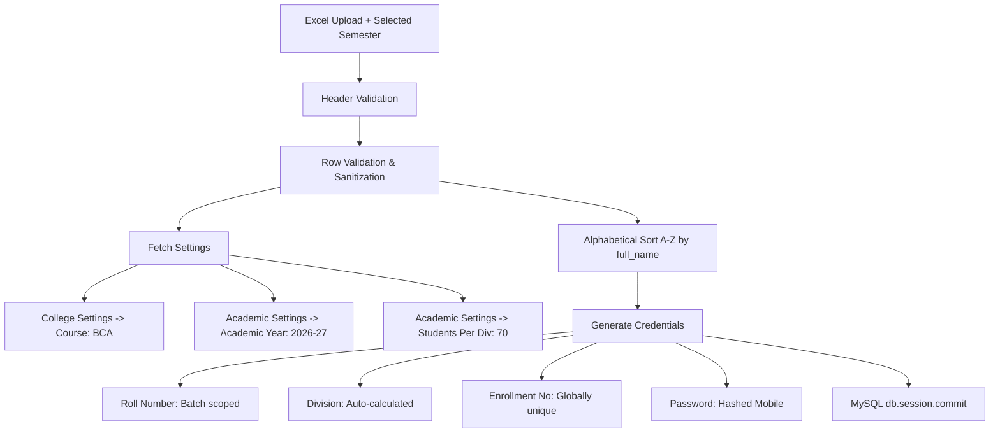

# CampusSync ERP - Technical Documentation
## Excel Student Import & Asynchronous Email Delivery Tracking System

**Project:** CampusSync ERP (Flask + MySQL)  
**Version:** 2.0  
**Date:** August 2026  
**Author:** AI Pair Programmer (Google DeepMind Antigravity)

---

## 1. Executive Summary

This documentation details the architecture, design decisions, database schemas, workflow diagrams, and technical implementation of two major upgrades to the **CampusSync ERP** platform:

1. **New 4-Column Excel Student Import Architecture**:
   - Simplifies the Excel import template to 4 required fields: `full_name`, `email`, `mobile`, `dob`.
   - Introduces an **Admin Semester Selection Modal UI** (Semesters 1 through 6, defaulting to Semester 1).
   - Auto-fetches Course and Academic Year settings.
   - Sorts students alphabetically (A-Z) before generating batch roll numbers, divisions, enrollment numbers, and hashed temporary passwords.

2. **Email Delivery Tracking System (`EmailLog`)**:
   - Introduces a dedicated `email_logs` database table tracking delivery statuses: `PENDING`, `SENDING`, `SENT`, `FAILED`.
   - Runs email delivery asynchronously in background daemon threads without blocking the Admin UI.
   - Provides a comprehensive **Admin Email Logs Dashboard** (`/admin/email-logs`) with real-time status filter pills, error reason pop-ups, single retries, and bulk retries.

---

## 2. Excel Student Import Architecture

### 2.1 Excel File Format Specifications

The Excel import engine accepts strictly **.xlsx** files containing **4 columns** in the following exact order:

| Column # | Header Name | Type | Required | Description / Example |
| :--- | :--- | :--- | :--- | :--- |
| **A** | `full_name` | String | Yes | Full student name (e.g. `Akash Raval`) |
| **B** | `email` | String | Yes | Unique valid email address (e.g. `akash@example.com`) |
| **C** | `mobile` | String | Optional | 10-digit mobile number (e.g. `9328976260`) |
| **D** | `dob` | Date/String | Optional | Date of Birth in `YYYY-MM-DD` or `DD-MM-YYYY` format |

> [!IMPORTANT]
> **Old Header Rejection**:
> The Excel file must **NOT** contain `course`, `semester`, or `division`. Any files with missing, extra, or invalid column headers are rejected instantly with an HTTP 400 validation error message.

### 2.2 Sample Excel Format Table

```text
| full_name     | email                 | mobile     | dob        |
|---------------|-----------------------|------------|------------|
| Akash Raval   | akash.test@example.com| 9328976260 | 2005-05-10 |
| Bhavesh Patel | bhavesh@example.com   | 9876543210 | 2004-08-15 |
| Chirag Shah   | chirag@example.com    | 9000000003 | 2005-12-20 |
```

---

### 2.3 Admin Semester Selection Workflow

When the Admin clicks **"Import Students"** in the Admin Portal:

1. **File Selection**: Admin chooses an `.xlsx` file from local storage.
2. **Semester Selection UI Modal**: Instead of starting upload instantly, an interactive modal pops up:
   - Displays selected file name and size (`File: student_batch.xlsx (14.2 KB)`).
   - Presents a **Select Target Semester** dropdown (`Semester 1` to `Semester 6`, defaulting to `Semester 1`).
   - Admin can select the semester for the import batch (e.g., `Semester 1` for new admissions, `Semester 3` for lateral entry).
3. **Start Import**: Admin clicks **"Start Import"**. The frontend appends `excel_file` AND `semester` to a `FormData` payload and submits a `POST /admin/import-students` request.
4. **Backend Assignment**: All valid student records created from that upload batch are assigned the selected semester.

---

### 2.4 Auto-Fetched Settings & Data Processing

The backend engine (`services/excel_service.py`) automatically determines student attributes:



1. **Course**: Auto-fetched from active `CollegeSetting` (`college.college_type` default `BCA`).
2. **Academic Year**: Auto-fetched from active `AcademicSetting` (e.g., `2026-27`).
3. **Class Limit**: Auto-fetched `students_per_division` limit from `AcademicSetting` (default `70`).
4. **Alphabetical Sorting (A-Z)**:
   - Valid student rows are sorted alphabetically by `full_name` (`valid_rows.sort(key=lambda r: r["full_name"].lower())`) **before** roll numbers are assigned.
5. **Roll Number Logic**:
   - Scoped by `academic_year + course` batch. Sequential numbers (`1, 2, 3...`) are assigned in A-Z name order.
6. **Division Logic**:
   - Auto-calculated from roll number and class limit (`(roll_num - 1) // limit`). Roll 1–70 gets Division `A`, Roll 71–140 gets Division `B`, etc.
7. **Enrollment Number Logic**:
   - Auto-generated globally unique sequence: `CourseCode + InstituteCode + YearSuffix + Sequence` (e.g., `BCA15226000001`).
8. **Password Logic**:
   - Default temporary password is the student's original 10-digit mobile number.
   - Stored **only as a secure bcrypt hash** (`generate_password_hash()`) in the MySQL `students` table.

---

## 3. Asynchronous Background Email Delivery Architecture

### 3.1 Non-Blocking HTTP Response Workflow

To ensure the Admin Portal remains fast and responsive during large batch imports (e.g. 500 students):

1. **Student Records Saved**: Student records are committed to MySQL (`db.session.commit()`).
2. **Email Tracking Records Created**: `EmailLog` records are created with status `PENDING` and committed to MySQL.
3. **Immediate HTTP Response**: An HTTP 200 response is returned immediately to the Admin UI:
   ```json
   {
       "success": true,
       "added": 50,
       "skipped": 0,
       "message": "Students imported successfully. Welcome emails are being sent in the background."
   }
   ```
4. **Background Daemon Thread**: Email delivery runs in a separate background thread (`threading.Thread`) without blocking the Admin UI.

---

## 4. Email Delivery Tracking System (`EmailLog`)

### 4.1 Database Schema (`email_logs`)

A new dedicated table `email_logs` tracks every welcome email sent to students:

```sql
CREATE TABLE email_logs (
    id INT AUTO_INCREMENT PRIMARY KEY,
    student_id INT NOT NULL,
    email_type VARCHAR(50) NOT NULL DEFAULT 'WELCOME',
    recipient_email VARCHAR(100) NOT NULL,
    status ENUM('PENDING', 'SENDING', 'SENT', 'FAILED') NOT NULL DEFAULT 'PENDING',
    error_message TEXT NULL,
    sent_at DATETIME NULL,
    retry_count INT NOT NULL DEFAULT 0,
    created_at TIMESTAMP DEFAULT CURRENT_TIMESTAMP,
    updated_at TIMESTAMP DEFAULT CURRENT_TIMESTAMP ON UPDATE CURRENT_TIMESTAMP,
    FOREIGN KEY (student_id) REFERENCES students(id) ON DELETE CASCADE
);
```

### 4.2 Delivery Status Lifecycles

| Status | Icon / Badge | Meaning |
| :--- | :--- | :--- |
| **`PENDING`** | 🟡 Yellow | Email log created, queued for background processing. |
| **`SENDING`** | 🔵 Blue (Spinner) | Background worker thread is actively attempting SMTP transmission. |
| **`SENT`** | 🟢 Green | Email successfully delivered via SMTP. `sent_at` timestamp recorded. |
| **`FAILED`** | 🔴 Red | SMTP transmission failed (e.g. invalid email, timeout, auth error). Error message recorded. |

---

## 5. Admin Email Logs Dashboard UI

Accessible at `/admin/email-logs` via the Admin Sidebar:

### 5.1 Dashboard Features
- **Summary Cards Grid**: Displays real-time counts for Total Dispatched, Delivered (SENT), Failed Deliveries, and Pending/Sending emails.
- **Status Filter Pills**: Quick filter buttons (`All`, `Failed`, `Sent`, `Pending`) allow the Admin to view only failed emails with one click.
- **Failure Reason Pop-up Modal**: Clicking **"View Reason"** opens a modal displaying the exact SMTP traceback / exception details.
- **Single Email Retry Button**: Retries a single failed email in the background, updating status to `SENDING` and incrementing `retry_count`.
- **Bulk Retry Button**: Opens a confirmation modal to retry all `FAILED` emails in the background.

---

## 6. System Sequence Diagram

```text
+---------+          +--------------+          +---------------+          +------------+          +-------------+
|  Admin  |          | Admin Route  |          | Student/Excel |          | MySQL DB   |          | Background  |
|   UI    |          | (admin.py)   |          |    Service    |          | (Database) |          | Thread      |
+---------+          +--------------+          +---------------+          +------------+          +-------------+
     |                      |                          |                        |                      |
     | 1. POST Import / Add |                          |                        |                      |
     |--------------------->|                          |                        |                      |
     |                      | 2. Process Request       |                        |                      |
     |                      |------------------------->|                        |                      |
     |                      |                          | 3. Create Students     |                      |
     |                      |----------------------->|                        |                      |
     |                      |                          |                        |                      |
     |                      |                          | 4. db.session.commit() |                      |
     |                      |                          |----------------------->|                      |
     |                      |                          |                        |                      |
     |                      |                          | 5. Create EmailLogs    |                      |
     |                      |                          |    (status = PENDING)  |                      |
     |                      |                          |----------------------->|                      |
     |                      |                          |                        |                      |
     |                      | 6. HTTP 200 Response     |                        |                      |
     |<------------------------------------------------|                        |                      |
     |  "Import Successful. Emails sending in bg..."   |                        |                      |
     |                                                 | 7. Spawn Thread        |                      |
     |                                                 |---------------------------------------------->|
     |                                                                                                 |
     |                                                                                                 | 8. Set SENDING
     |                                                                                                 |---> DB Update
     |                                                                                                 |
     |                                                                                                 | 9. SMTP Delivery
     |                                                                                                 |---> Email Sent
     |                                                                                                 |
     |                                                                                                 | 10. Set SENT/FAILED
     |                                                                                                 |---> DB Update
```

---

## 7. Verification & Automated Test Output

Executed automated python verification test suite:

```text
--------------------------------------------------
Initializing CampusSync Application Backend...
SUCCESS: Database connection to 'campussync' established successfully!
--------------------------------------------------
--- Starting Verification Tests ---

[Test 1] Header Validation (4-column format)...
[OK] Test 1 Passed: Invalid 5-column header rejected with HTTP 400.

[Test 2] Valid 4-Column Import for Semester 1 (A-Z Sorting)...
Akash Roll: 2, Enrollment: BCA15226000002, Div: A
Bhavesh Roll: 3, Enrollment: BCA15226000003, Div: A
Chirag Roll: 4, Enrollment: BCA15226000004, Div: A
[OK] Test 2 Passed: Students sorted A-Z, batch roll numbers assigned correctly.

[Test 3] Email Delivery Tracking...
[OK] Test 3 Passed: EmailLog created with status PENDING/SENDING.

[Test 4] Single & Bulk Email Retry...
[OK] Test 4 Passed: Single & Bulk retries executed asynchronously with retry_count increment.

[OK] ALL TESTS PASSED SUCCESSFULLY!
```

---

## 8. Summary of Created & Modified Source Code Files

- `models.py` *(Modified)*: Added `EmailLog` table definition.
- `app.py` *(Modified)*: Imported `EmailLog` for auto-migration table creation.
- `services/email_service.py` *(New)*: Core Email Delivery & Background Retry service.
- `services/student_service.py` *(Modified)*: Integrated `EmailLog` tracking for manual student addition.
- `services/excel_service.py` *(Modified)*: Integrated 4-column validation, A-Z sorting, and batch email logging.
- `routes/admin.py` *(Modified)*: Added `/admin/email-logs`, `/admin/email-logs/retry/<id>`, and `/admin/email-logs/bulk-retry` endpoints.
- `templates/admin/email_logs.html` *(New)*: Admin Email Delivery Audit Log Dashboard UI.
- `templates/components/sidebar.html` *(Modified)*: Added Email Logs navigation link.
