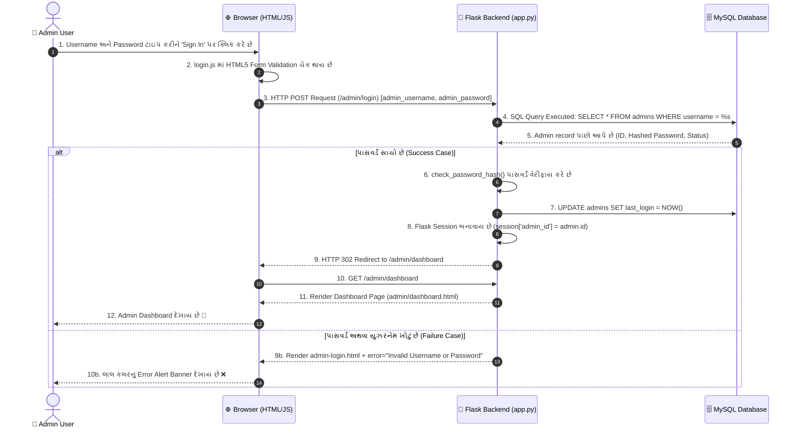

# 🔐 CampusSync - Admin Login Data Flow & Architecture Documentation

આ ડૉક્યુમેન્ટમાં **CampusSync** એપ્લિકેશનમાં એડમિન લોગિન (Admin Login) વખતે ડેટા યુઝર પાસથી કેવી રીતે પ્રોસેસ થઈને સેવ અને વેરીફાય થાય છે તેની સંપૂર્ણ અને સરળ ટેકનિકલ સમજૂતી છે.

---

## 1. 🏗️ મુખ્ય કમ્પોનન્ટ્સ (Key Components)

1. **Frontend (UI & Validation)**: 
   - `templates/auth/admin-login.html`: યુઝર લોગિન ફોર્મ.
   - `assets/js/login.js`: ક્લાયન્ટ સાઇડ બ્રાઉઝર વેલિડેશન અને સ્પિનર બટન સપોર્ટ.

2. **Network Protocol (HTTP Transport)**:
   - HTTP `POST` વિનંતી દ્વારા યુઝરના ક્રિડેન્શિયલ્સ (Username, Password) સુરક્ષિત રીતે સર્વર સુધી પહોંચે છે.

3. **Backend Server (Flask App)**:
   - `app.py`: `@app.route('/admin/login')` લોગિન લોજિક ચલાવે છે, સેશન મેનેજ કરે છે અને પાસવર્ડ હેશ સરખાવે છે.

4. **Database Helpers (MySQL Connection)**:
   - `utils/db.py`: ડેટાબેઝ સાથે સુરક્ષિત કનેક્શન બનાવે છે.

---

## 2. 📊 સેક્વન્સ ડાયાગ્રામ (Sequence Diagram)



---

## 3. 🔄 ડેટાની મુસાફરી: સ્ટેપ-બાય-સ્ટેપ વિગતવાર સમજૂતી (Step-by-Step Data Journey)

### 🔹 Step 1: યુઝર ડેટા એન્ટ્રી (Client Side - HTML Form)
* **ફાઇલ**: [admin-login.html](file:///c:/A-project/CampusSync/templates/auth/admin-login.html#L141-L190)
* યુઝર ઇનપુટ બોક્સમાં પોતાના ક્રિડેન્શિયલ્સ ભરે છે:
  - `admin_username`
  - `admin_password`
* **"Sign In"** દબાવતાં HTML નું `<form action="/admin/login" method="POST">` એક્ટિવ થાય છે.

---

### 🔹 Step 2: ક્લાયન્ટ-સાઇડ ચકાસણી (JavaScript Interception)
* **ફાઇલ**: [login.js](file:///c:/A-project/CampusSync/assets/js/login.js#L79-L99)
* ફોર્મ સબમિટ થતાં બ્રાઉઝરમાં રન થતી `login.js` ફાઇલ ખાતરી કરે છે કે બધાં જ જરૂરી ફીલ્ડ્સ ભરાયેલાં છે (`checkValidity()`).
* જો બધું ઓકે હોય તો બટન પર **"Authenticating..."** લોડર ચાલુ થાય છે.

---

### 🔹 Step 3: ઇન્ટરનેટ/નેટવર્ક પર ડેટાનું વહન (HTTP POST Packet)
* બ્રાઉઝર બેકએન્ડ સર્વર પર એક સુરક્ષિત **HTTP POST Request** મોકલે છે:
  ```http
  POST /admin/login HTTP/1.1
  Host: localhost:5000
  Content-Type: application/x-www-form-urlencoded

  admin_username=admin&admin_password=admin123
  ```

---

### 🔹 Step 4: ફ્લાસ્ક બેકએન્ડમાં ડેટાનું આગમન (Flask Controller)
* **ફાઇલ**: [app.py](file:///c:/A-project/CampusSync/app.py#L37-L54)
* ફ્લાસ્ક એપમાં `@app.route('/admin/login', methods=['GET', 'POST'])` કોલ થાય છે.
* ફ્લાસ્ક આવેલો ડેટા મેળવે છે:
  ```python
  username = request.form.get('admin_username')
  password = request.form.get('admin_password')
  ```

---

### 🔹 Step 5: ડેટાબેઝ ક્વેરી (Database Query Execution)
* **ફાઇલ**: [db.py](file:///c:/A-project/CampusSync/utils/db.py) અને [app.py](file:///c:/A-project/CampusSync/app.py#L55-L66)
* ફ્લાસ્ક `get_db_connection()` દ્વારા ડેટાબેઝ સાથે કનેક્ટ થઈ ક્વેરી ચલાવે છે:
  ```sql
  SELECT * FROM admins WHERE username = %s LIMIT 1
  ```
* ડેટાબેઝમાંથી તે એડમિનનો રેકોર્ડ (હેશ્ડ પાસવર્ડ સાથે) ફ્લાસ્કને મળે છે.

---

### 🔹 Step 6: પાસવર્ડ સિક્યોરિટી અને વેરીફિકેશન (Werkzeug Hash Check)
* **ફાઇલ**: [app.py](file:///c:/A-project/CampusSync/app.py#L68-L77)
* Werkzeug નું `check_password_hash()` ફંક્શન યુઝરે આપેલા પાસવર્ડ અને હેશ થયેલા પાસવર્ડને સરખાવે છે:
  ```python
  is_valid_password = check_password_hash(admin['password'], password)
  ```

---

### 🔹 Step 7: સેશન બનાવવું અને રીડાયરેક્શન (Session & Response)
* **ફાઇલ**: [app.py](file:///c:/A-project/CampusSync/app.py#L84-L96)
* લોગિન સફળ થતાં:
  1. ડેટાબેઝમાં `last_login = NOW()` અપડેટ થાય છે.
  2. બ્રાઉઝર માટે Flask Session સેટ થાય છે: `session["admin_id"] = admin['id']`.
  3. સર્વર બ્રાઉઝરને ડેશબોર્ડ પર મોકલે છે (`redirect(url_for('admin_dashboard'))`).

---

## 4. 🧠 Summary Flow Diagram (ડેટા નો આખો પ્રવાહ એક નજરમાં)

```text
[ 👤 User ]
   │  (Input Username & Password)
   ▼
[ 🌐 HTML Form (admin-login.html) ]
   │  (JS Validation check in login.js)
   ▼
[ 📡 HTTP POST Request ]
   │  (Body: admin_username & admin_password)
   ▼
[ 🐍 Flask Backend (app.py: admin_login()) ]
   │  (request.form.get())
   ▼
[ 🗄️ MySQL DB Query (utils/db.py) ]
   │  (SELECT * FROM admins WHERE username = %s)
   ▼
[ 🔑 Password Hash Verification (check_password_hash) ]
   │
   ├─── ❌ Incorrect Password ──► Return login page with Error Message
   │
   └─── ✅ Correct Password ───► 1. Save session["admin_id"]
                                2. Redirect to /admin/dashboard
                                3. Display Admin Dashboard 🎉
```

---

## 🔒 મુખ્ય સિક્યોરિટી ફીચર્સ (Key Security Concepts)

| ફીચર (Feature) | કેવી રીતે કામ કરે છે? (How it works?) |
| :--- | :--- |
| **SQL Injection Prevention** | `%s` પેરામીટરાઇઝ્ડ ક્વેરીનો ઉપયોગ કરવાથી હેકર્સ ડેટાબેઝ હેક કરી શકતા નથી. |
| **Password Hashing** | `Werkzeug` ના `generate_password_hash` અને `check_password_hash` થી પાસવર્ડ સુરક્ષિત રહે છે. |
| **Session Protection** | ડેશબોર્ડ પેજ પર જો સેશન વગર કોઈ સીધું `/admin/dashboard` ટાઇપ કરે તો તેને પાછો લોગિન પેજ પર મોકલી દેવાય છે. |
